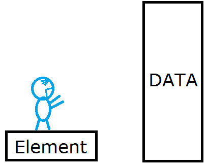

# 第十章 理解 Update、Enter、Exit

Update、Enter、Exit 是 D3 中三个非常重要的概念，它处理的是当选择集和数据的数量关系不确定的情况。



## 什么是 Update、Enter、Exit

前几章里，反复出现了形如以下的代码。

```javascript
svg
  .selectAll('rect') //选择svg内所有的矩形
  .data(dataset) //绑定数组
  .enter() //指定选择集的enter部分
  .append('rect') //添加足够数量的矩形元素
```

前面提到，这段代码使用的情况是当以下情况出现的时候：

**有数据，而没有足够图形元素的时候，使用此方法可以添加足够的元素。**

当时并没有深究这段代码是什么意思，本章将对此进行讲解。但是，由于此问题相对复杂，本章只进行最初步的介绍。

假设，在 body 中有三个 p 元素，有一数组 [3, 6, 9]，则可以将数组中的每一项分别与一个 p 元素绑定在一起。但是，有一个问题：**当数组的长度与元素数量不一致（数组长度 > 元素数量 or 数组长度 < 元素数量）时呢？**这时候就需要理解 Update、Enter、Exit 的概念。

如果数组为 [3, 6, 9, 12, 15]，将此数组绑定到三个 p 元素的选择集上。可以想象，会有两个数据没有元素与之对应，这时候 D3 会建立两个空的元素与数据对应，这一部分就称为 **Enter**。而有元素与数据对应的部分称为 **Update**。如果数组为 [3]，则会有两个元素没有数据绑定，那么没有数据绑定的部分被称为 **Exit**。示意图如下所示。


看到这，我想大家能体会到为什么本节最开始处的代码能够给 SVG 内添加足够数量的元素了吧。它的意思其实是：

此时 SVG 里没有 rect 元素，即元素数量为 0。有一数组 dataset，将**数组**与**元素数量为 0 的选择集**绑定后，选择其 Enter 部分（请仔细看上图），然后添加（append）元素，也就是添加足够的元素，使得每一个数据都有元素与之对应。

## Update 和 Enter 的使用

当对应的元素不足时 （ 绑定数据数量 > 对应元素 ），需要添加元素（append）。

现在 body 中有三个 p 元素，要绑定一个长度大于 3 的数组到 p 的选择集上，然后分别处理 update 和 enter 两部分。

```javascript
var dataset = [3, 6, 9, 12, 15]

//选择body中的p元素
var p = d3.select('body').selectAll('p')

//获取update部分
var update = p.data(dataset)

//获取enter部分
var enter = update.enter()

//update部分的处理：更新属性值
update.text(function (d) {
  return 'update ' + d
})

//enter部分的处理：添加元素后赋予属性值
enter.append('p').text(function (d) {
  return 'enter ' + d
})
```

结果如下图，update 部分和 enter 部分被绑定的数据很清晰地表示了出来。


请大家记住：

- update 部分的处理办法一般是：更新属性值
- enter 部分的处理办法一般是：添加元素后，赋予属性值

## Update 和 Exit 的使用

当对应的元素过多时 （ 绑定数据数量 < 对应元素 ），需要删掉多余的元素。

现在 body 中有三个 p 元素，要绑定一个长度小于 3 的数组到 p 的选择集上，然后分别处理 update 和 exit 两部分。

```javascript
var dataset = [3]

//选择body中的p元素
var p = d3.select('body').selectAll('p')

//获取update部分
var update = p.data(dataset)

//获取exit部分
var exit = update.exit()

//update部分的处理：更新属性值
update.text(function (d) {
  return 'update ' + d
})

//exit部分的处理：修改p元素的属性
exit.text(function (d) {
  return 'exit'
})

//exit部分的处理通常是删除元素
// exit.remove();
```

结果如下，请大家区分好 update 部分和 exit 部分。这里为了表明哪一部分是 exit，并没有删除掉多余的元素，但实际上 exit 部分的绝大部分操作是删除。


请大家记住：

- exit 部分的处理办法一般是：删除元素（remove）

## 源代码

下载地址：[rm70.zip](http://www.ourd3js.com/src/rm/rm70.zip)

展示地址：[http://www.ourd3js.com/demo/rm/R-7.0/enter.html](http://www.ourd3js.com/demo/rm/R-7.0/enter.html)

展示地址：[http://www.ourd3js.com/demo/rm/R-7.0/exit.html](http://www.ourd3js.com/demo/rm/R-7.0/exit.html)
