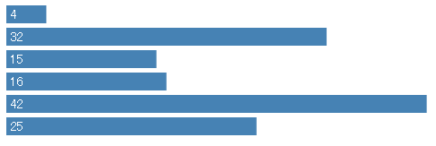
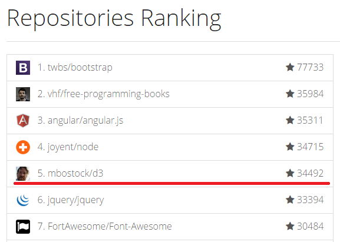

# 第一章 简介和安装

近年来，可视化越来越流行，许多报刊杂志、门户网站、新闻、媒体都大量使用可视化技术，使得复杂的数据和文字变得十分容易理解，有一句谚语“一张图片价值于一千个字”，的确是名副其实。各种数据可视化工具也如井喷式地发展，D3 正是其中的佼佼者。

## D3 是什么

D3 的全称是（Data-Driven Documents），顾名思义可以知道是一个被数据驱动的文档。听名字有点抽象，说简单一点，其实就是一个 JavaScript 的函数库，使用它主要是用来做数据可视化的。

JavaScript 文件的后缀名通常为 .js，故 D3 也常使用 D3.js 称呼。D3 提供了各种简单易用的函数，大大简化了 JavaScript 操作数据的难度。由于它本质上是 JavaScript ，所以用 JavaScript 也是可以实现所有功能的，但它能大大减小你的工作量，尤其是在数据可视化方面，D3 已经将生成可视化的复杂步骤精简到了几个简单的函数，你只需要输入几个简单的数据，就能够转换为各种绚丽的图形。有过 JavaScript 基础的朋友一定很容易理解它。

## 为什么要数据可视化

现在有一组数据， 【 4 ， 32 ， 15 ， 16 ， 42 ， 25 】 ，你能一眼看出它们的大小关系吗？当然这里的数据不算多，有那眼疾手快的家伙站出来说我能一眼看出来！但更直观的是用图形显示，如下图：

通过图形的显示，能很清楚地知道他们的大小关系。当然，D3 能力远不止如此，这只是一个很小的应用。把枯燥乏味复杂的数据，用简单明了的图形表示出来，这就是**数据可视化**。

## D3 有多受欢迎

D3 是一个开源项目，作者是纽约时报的工程师。D3 项目的代码托管于 GitHub（一个开发管理平台，目前已经是全世界最流行的代码托管平台，云集了来自世界各地的优秀工程师）。

在 GitHub 上最受关注的项目有哪些呢？

JQuery 的名声够大了，但排名第 6，D3 却排名第 5。

## 如何学习和使用 D3

以下是几个学习 D3 的站点：

- [官方网站](http://d3js.org/): 包含有很多示例和 API，要想得心应手的使用 D3，熟悉 API 是避不开的。
- [Mike Bostock 的博客和作品展示板](http://bost.ocks.org/mike/)
- [d3 简单易懂的图表示例](https://www.d3-graph-gallery.com/all.html)

## 学习 D3 需要什么预备知识

想要通过 D3 来开启数据可视化之旅的朋友，需要什么预备知识呢？

- HTML：超文本标记语言，用于设定网页的内容
- CSS：层叠样式表，用于设定网页的样式
- JavaScript：一种直译式脚本语言，用于设定网页的行为
- DOM：文档对象模型，用于修改文档的内容和结构
- SVG：可缩放矢量图形，用于绘制可视化的图形
- yarn/vite/ts 等现代前端必须的技能

## 需要什么工具

- VSCode
- Chrome 最新版
