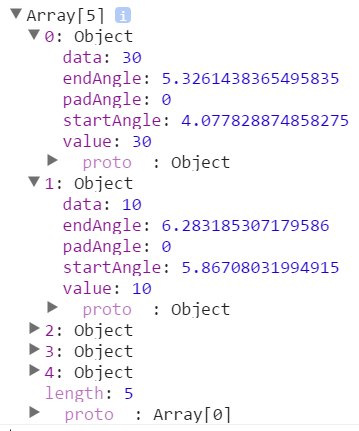

# 第十三章 饼状图的制作

本章制作一个饼状图。在布局的应用中，最简单的就是饼状图，通过本文你将对布局有一个初步了解。


## 数据

有如下数据，需要可视化：

```javascript
var dataset = [30, 10, 43, 55, 13]
```

这样的值是不能直接绘图的。例如绘制饼状图的一个部分，需要知道一段弧的起始角度和终止角度，这些值都不存在于数组 dataset 中。因此，需要用到布局，布局的作用就是：

**计算出适合于作图的数据。**

这一个过程，在本教程中为了方便理解，笔者称之为“数据转换”。

## 布局（数据转换）

定义一个布局，

```javascript
var pie = d3.layout.pie()
```

返回值赋给变量 pie，此时 pie 可以当做函数使用。

```javascript
var piedata = pie(dataset)
```

将数组 dataset 作为 pie() 的参数，返回值给 piedata。如此一来，

**piedata 就是转换后的数据。**

简单吧，非常轻松就得到了。在控制台输出 piedata ，让我们来看看数据转换成什么了。



如上图所示，5 个整数被转换成了 5 个对象（Object） ，每个对象都有变量**起始角度（startAngle）**和**终止角度（endAngle）**，还有**原数据（属性名称为 data）**。这些都是绘图需要的数据。

千万记住：**布局要直接绘图，而是为了得到绘图所需的数据**。

## 绘制图形

为了根据转换后的数据 piedata 来作图，还需要一样工具：生成器。

SVG 有一个元素，叫做路径 path，是 SVG 中功能最强的元素，它可以表示其它任意的图形。顾名思义，路径元素就是通过定义一个段“路径”，来绘制出各种图形。但是，路径是很难计算的，通过布局转换后的数据 piedata 仍然很难手动计算得到路径值。为我们完成这项任务的，就是**生成器**。

这里要用到的叫做**弧生成器**，能够生成弧的路径，因为饼图的每一部分都是一段弧。

```javascript
var outerRadius = 150 //外半径
var innerRadius = 0 //内半径，为0则中间没有空白

var arc = d3.svg
  .arc() //弧生成器
  .innerRadius(innerRadius) //设置内半径
  .outerRadius(outerRadius) //设置外半径
```

弧生成器返回的结果赋值给 arc。此时，arc 可以当做一个函数使用，把 piedata 作为参数传入，即可得到路径值。

接下来，可以在 SVG 中添加图形元素了。先在 svg 里添加足够数量（5 个）个分组元素（g），每一个分组用于存放一段弧的相关元素。

```javascript
var arcs = svg
  .selectAll('g')
  .data(piedata)
  .enter()
  .append('g')
  .attr('transform', 'translate(' + width / 2 + ',' + width / 2 + ')')
```

接下来对每个 g 元素，添加 path 。

```javascript
arcs
  .append('path')
  .attr('fill', function (d, i) {
    return color(i)
  })
  .attr('d', function (d) {
    return arc(d) //调用弧生成器，得到路径值
  })
```

因为 arcs 是同时选择了 5 个 g 元素的选择集，所以调用 append(“path”) 后，每个 g 中都有 path 。路径值的属性名称是 d，调用弧生成器后返回的值赋值给它。要注意，arc(d) 的参数 d 是被绑定的数据。

另外，color 是一个颜色比例尺，它能根据传入的索引号获取相应的颜色值，定义如下。

```javascript
var color = d3.scale.category10() //有十种颜色的颜色比例尺
```

然后在每一个弧线中心添加文本。

```javascript
arcs
  .append('text')
  .attr('transform', function (d) {
    return 'translate(' + arc.centroid(d) + ')'
  })
  .attr('text-anchor', 'middle')
  .text(function (d) {
    return d.data
  })
```

arc.centroid(d) 能算出弧线的中心。要注意，text() 里返回的是 d.data ，而不是 d 。因为被绑定的数据是对象，里面有 d.startAngle、d.endAngle、d.data 等，其中 d.data 才是转换前的整数的值。

## 源代码

下载地址：[rm80.zip](http://www.ourd3js.com/src/rm/rm91.zip)

展示地址：[http://www.ourd3js.com/demo/rm/R-9.1/pie.html](http://www.ourd3js.com/demo/rm/R-9.1/pie.html)
