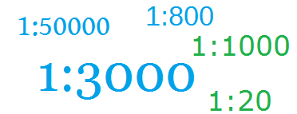

# 第六章 比例尺的使用

比例尺是 D3 中很重要的一个概念，上一章里曾经提到过直接用数值的大小来代表像素不是一种好方法，本章正是要解决此问题。



## 为什么需要比例尺

上一章制作了一个柱形图，当时有一个数组：

```javascript
var dataset = [250, 210, 170, 130, 90]
```

绘图时，直接使用 250 给矩形的宽度赋值，即矩形的宽度就是 250 个像素。

此方式非常具有局限性，如果数值过大或过小，例如：

```javascript
var dataset_1 = [2.5, 2.1, 1.7, 1.3, 0.9]
var dataset_2 = [2500, 2100, 1700, 1300, 900]
```

对以上两个数组，绝不可能用 2.5 个像素来代表矩形的宽度，那样根本看不见；也不可能用 2500 个像素来代表矩形的宽度，因为画布没有那么长。

于是，我们需要一种计算关系，能够：

**将某一区域的值映射到另一区域，其大小关系不变。**

这就是比例尺（Scale）。

## 有哪些比例尺

比例尺，很像数学中的函数。例如，对于一个一元二次函数，有 x 和 y 两个未知数，当 x 的值确定时，y 的值也就确定了。

在数学中，x 的范围被称为**定义域**，y 的范围被称为**值域**。

D3 中的比例尺，也有定义域和值域，分别被称为 domain 和 range。开发者需要指定 domain 和 range 的范围，如此即可得到一个计算关系。

D3 提供了多种比例尺，下面介绍最常用的两种。

### 线性比例尺

线性比例尺，能将一个连续的区间，映射到另一区间。要解决柱形图宽度的问题，就需要线性比例尺。

假设有以下数组：

```javascript
var dataset = [1.2, 2.3, 0.9, 1.5, 3.3]
```

现有要求如下：

**将 dataset 中最小的值，映射成 0；将最大的值，映射成 300。**

代码如下：

```javascript
var min = d3.min(dataset)
var max = d3.max(dataset)

var linear = d3.scale.linear().domain([min, max]).range([0, 300])

linear(0.9) //返回 0
linear(2.3) //返回 175
linear(3.3) //返回 300
```

其中，**d3.scale.linear()** 返回一个线性比例尺。domain() 和 range() 分别设定比例尺的定义域和值域。在这里还用到了两个函数，它们经常与比例尺一起出现：

- d3.max()
- d3.min()

这两个函数能够求数组的最大值和最小值，是 D3 提供的。按照以上代码，

比例尺的定义域 domain 为：[0.9, 3.3]

比例尺的值域 range 为：[0, 300]

因此，当输入 0.9 时，返回 0；当输入 3.3 时，返回 300。当输入 2.3 时呢？返回 175，这是按照线性函数的规则计算的。

有一点请大家记住：

d3.scale.linear() 的返回值，是可以当做**函数**来使用的。因此，才有这样的用法：linear(0.9)。

### 序数比例尺

有时候，定义域和值域不一定是连续的。例如，有两个数组：

```javascript
var index = [0, 1, 2, 3, 4]
var color = ['red', 'blue', 'green', 'yellow', 'black']
```

我们希望 0 对应颜色 red，1 对应 blue，依次类推。

但是，这些值都是离散的，线性比例尺不适合，需要用到序数比例尺。

```javascript
var ordinal = d3.scale.ordinal().domain(index).range(color)

ordinal(0) //返回 red
ordinal(2) //返回 green
ordinal(4) //返回 black
```

用法与线性比例尺是类似的。

## 给柱形图添加比例尺

在上一章的基础上，修改一下数组，再定义一个线性比例尺。

```javascript
var dataset = [2.5, 2.1, 1.7, 1.3, 0.9]

var linear = d3.scale
  .linear()
  .domain([0, d3.max(dataset)])
  .range([0, 250])
```

其后，按照上一章的方法添加矩形，在给矩形设置宽度的时候，应用比例尺。

```javascript
var rectHeight = 25 //每个矩形所占的像素高度(包括空白)

svg
  .selectAll('rect')
  .data(dataset)
  .enter()
  .append('rect')
  .attr('x', 20)
  .attr('y', function (d, i) {
    return i * rectHeight
  })
  .attr('width', function (d) {
    return linear(d) //在这里用比例尺
  })
  .attr('height', rectHeight - 2)
  .attr('fill', 'steelblue')
```

如此一来，所有的数值，都按照同一个线性比例尺的关系来计算宽度，因此数值之间的大小关系不变。

## 源代码

下载地址：[rm40.zip](http://www.ourd3js.com/src/rm/rm40.zip)

展示地址：[http://www.ourd3js.com/demo/rm/R-4.0/UseScaleInChart.html](http://www.ourd3js.com/demo/rm/R-4.0/UseScaleInChart.html)
